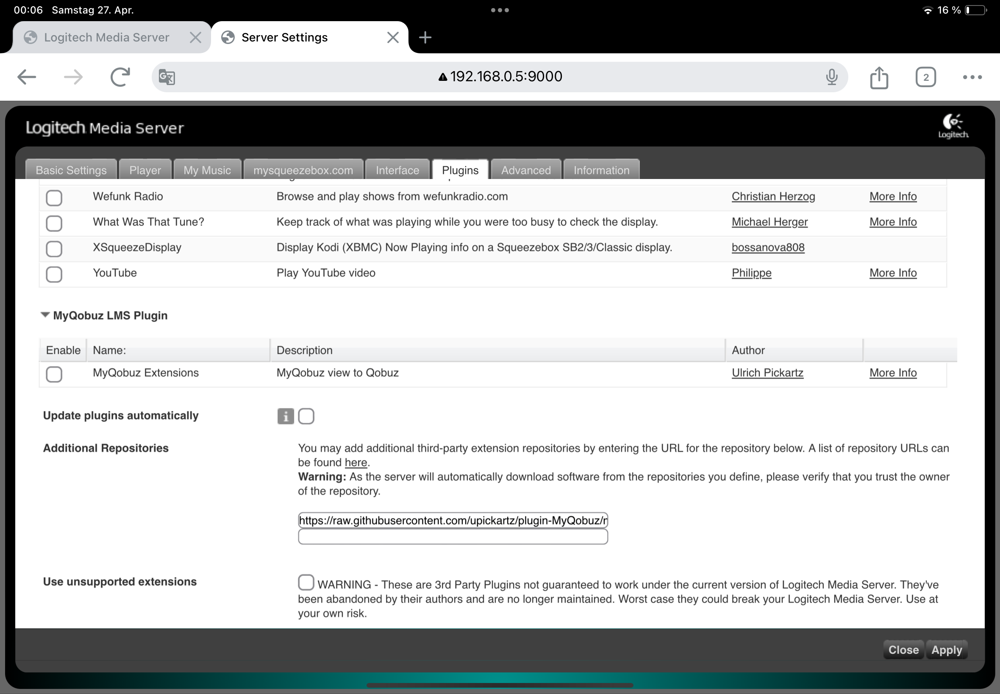
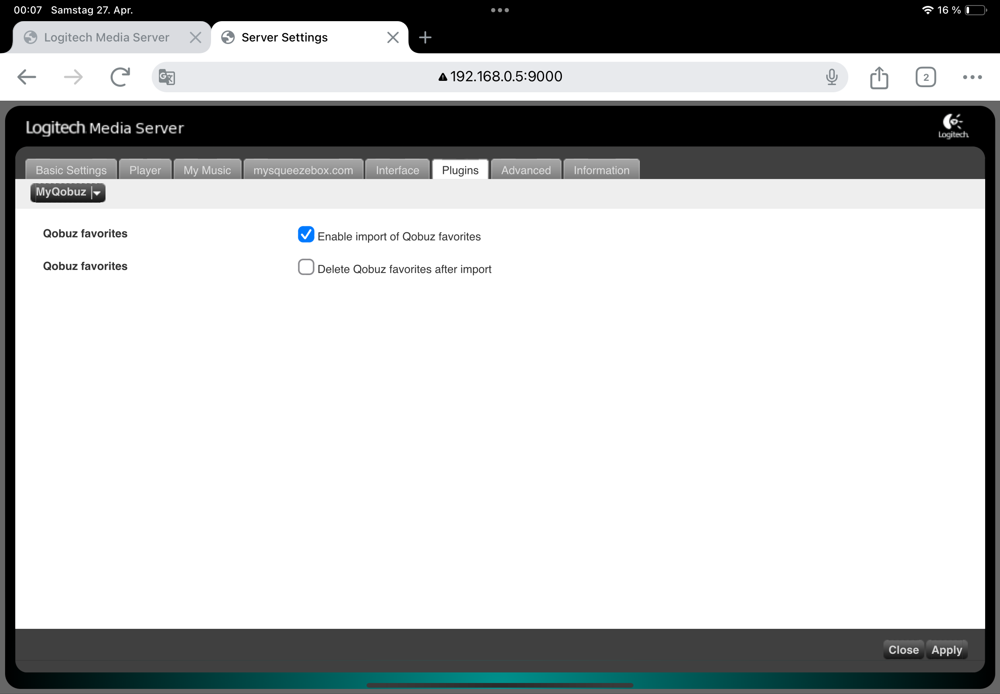
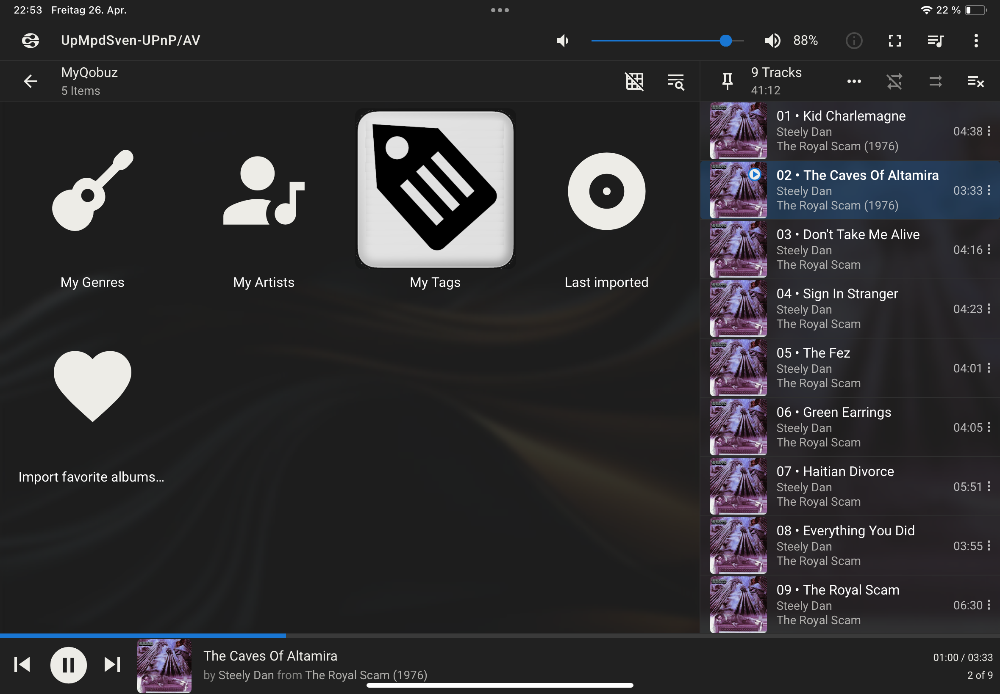
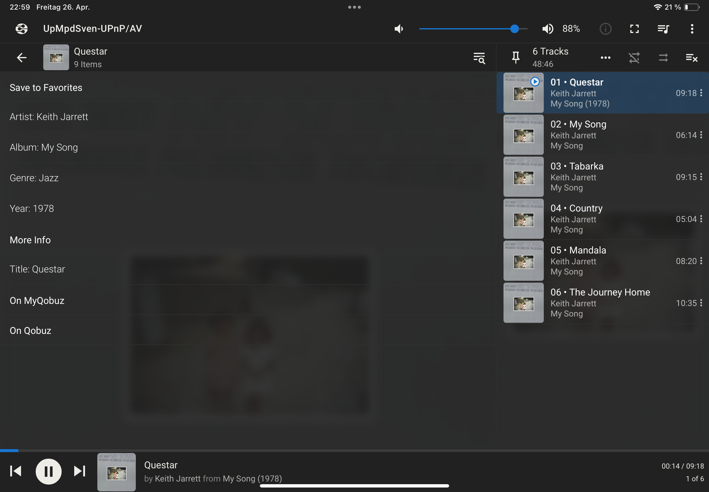

# plugin-MyQobuz

## Motivation
The Qobuz plugin (https://github.com/LMS-Community/plugin-Qobuz) is a great tool for exploring new music. What I was missing was access to a defined collection of albums, for hearing my music on Qobuz, not seeing each album of an artist. Inspired by my old vinyl lp collection, I would like to access my music by genre -> artist -> album or artist-> album.

Therefore, a new plugin 'MyQobuz' is provided for the LMS, which contains my selected albums. 

## Features
Additionally, to the selection by genre and/or (alphabetically sorted) artists, a possibility to define tags for ‘MyQobuz’ albums is provided. 
Adding or removing albums to 'MyQobuz' will be done via an extension of the track menu. It is also possible to correct the definition of the genre of an album defined by Qobuz, because often the Qobuz definition doesn't fit for me.

It is also possible to add all “Qobuz” favorites to “MyQobuz”. In the settings you can configure whether the favorites should be removed from the Qobuz favorites after import or not.

The plugin 'MyQobuz' requires the functionality of the 'Qobuz' plugin, e.g. for playing the albums, searching for new albums and technical accessing the Qobuz API. The installation of the 'Qobuz' plugin is required for the 'MyQobuz' plugin and therefore also a Qobuz account for the user is required (the same as for the 'Qobuz' plugin). 

I know that the term 'MyQobuz' is already used in the Qobuz app with another philosophy, but I found it most intuitive for the new plugin. 

## Technical Solution
For the section 'MyQobuz' a separate sqlite database is provided. The default location of the database is in the prefs folder of the LMS (a proposal of Michael Herger) and the name of the database is 'MyQobuz.db'. Albums and assigned tracks are stored with their Qobuz ids. These ids sometimes change, but not very often in Qobuz. Therefore, a submenu 'Qobuz removed albums' is provided to search for the vanished albums, so one can remove the album and add it again, if available with another id. This submenu is only available if such albums exist. The genre of an album is stored in the album table. During insert, the Qobuz genre is stored in the genre column and in the qobuzGenre column. Therefore, the original genre is not lost if the user overrides the genre. But it is only available in the database. 

## User Guide

### Installation
Insert an additional repository 
 https://raw.githubusercontent.com/upickartz/plugin-MyQobuz/main/repo/myqobuz.xml
into the settings page of LMS. After applying you see the 'MyQobuz' plugin for activation:

After activation, you will find 'MyQobuz' in the 'Active plugin' section and you can navigate to the settings page:

### Selecting an Album from 'MyQobuz'
The entrance to the 'MyQobuz' section can be found in the application view of the LMS:

The 'MyQobuz' section allows access to the defined albums of 'MyQobuz' via genre-artist-album , artist-album, tag-artist-album, or tag-genre-artist-album. Also, the last imported albums can be visited and the import of the 'Qobuz* favorites can be triggered:

Using the tag e.g. 'lp', which means the album is also available as vinyl lp (in my home collection), is shown in the next screens:

### Edit 'MyQobuz' Collection of Albums
To add, remove, or edit entries of 'MyQobuz' one has to go over the track menu entry 'On Qobuz' during hearing an album via 'Qobuz':

In the example, you find the album 'My Song' by Keith Jarret just playing. So you get the entry 'My Song' add to 'MyQobuz', if it is not available:

If the album 'My Song' is already assigned and also tagged, you find the possibility to remove, edit the genre, and add or remove a tag:
 

At last, you get the possibility to show the 10 last imported albums from 'Qobuz' into 'MyQobuz' accessible via the artists:
 

